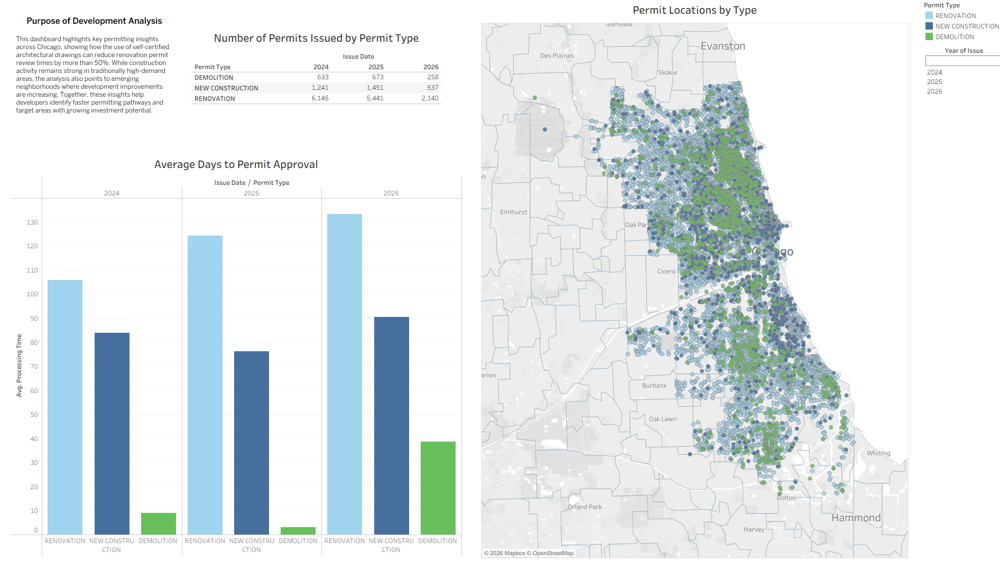

# Chicago-Permit-Analysis

# 📌 Overview
An interactive Tableau dashboard analyzing Chicago permit types, review timelines, and emerging neighborhoods. The project highlights where development activity is accelerating and identifies factors that contribute to shorter permitting paths, giving developers clearer insight into how to streamline approvals and target high‑opportunity areas.

---

# 🎯 Objectives
* **Interactive Dashboard**: Explore Chicago building permit trends visually.
* **Timeline Analysis**: Identify bottlenecks and factors reducing approval times.
* **Geospatial Mapping**: Discover emerging neighborhoods with accelerating development.
* **Predictive Insights**: Target high-opportunity areas based on historical data.

---

## 📊 Data Source
This analysis uses public data from the [City of Chicago Data Portal](https://cityofchicago.org).
* Dataset includes building permits issued from historical records to the present.
* Attributes analyzed include permit types, application dates, issue dates, and geographic coordinates.

---

## 🛠️ Tech Stack
* **Visualization**: Tableau Desktop / Tableau Public
* **Data Processing**: Excel Power Query
* **Data Source**: Chicago Data Portal API / CSV

---
  
## 📈 Dashboard Insights
* **Speed Factors**: Projects using certified plans experience significantly shorter review times.
* **Hotspots**: Specific West and South Side neighborhoods show a surge in commercial permits.

---

* # 📂 Repository Structure
```text
Code /Olist-Dashboard
 │── /visuals           # Screenshots & visuals
 │── /tableau-project   # Tableau project files
 │── README.md
```

---

# 📸 Dashboard Preview




## 💻 How to Access
Acces the data story directly via Tableau Public: [Developer permit Strategies in Chicago's Emerging Neighborhoods](https://public.tableau.com/app/profile/melissa.bopp/viz/DeveloperPermitStrategiesinChicagosEmergingNeighborhoods/Story1)


---

# 🏁 Conclusion
This project demonstrates strong analytical capabilities across the full data lifecycle — from cleaning and modeling to visualization and insight generation. It serves as a portfolio piece showcasing the ability to turn a large raw publicly available dataset into meaningful business intelligence.
